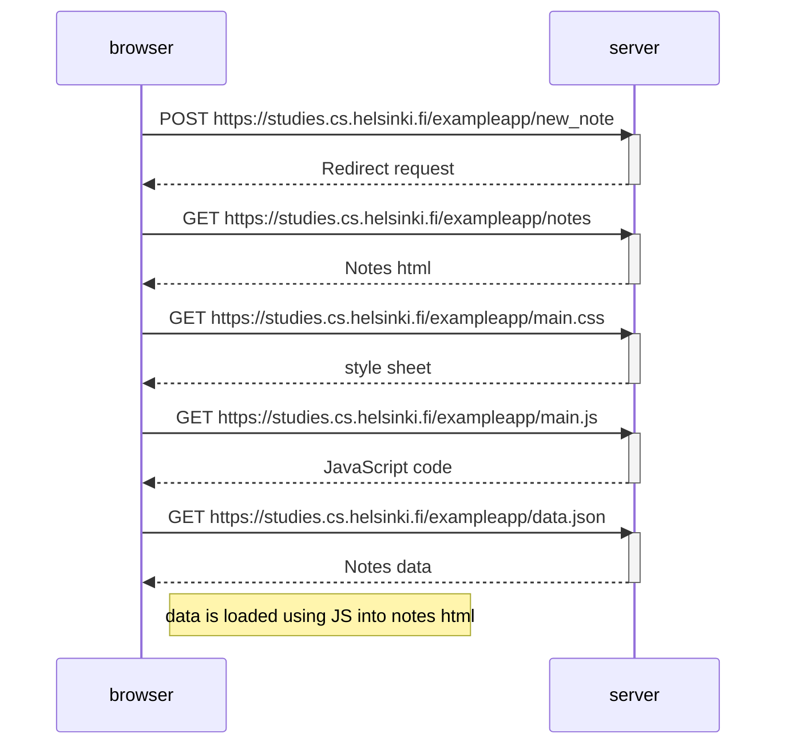

```mermaid

sequenceDiagram
  participant browser
  participant server

  browser->>server: POST https://studies.cs.helsinki.fi/exampleapp/new_note
  activate server
  server-->>browser: Redirect request
  deactivate server

  browser->>server: GET https://studies.cs.helsinki.fi/exampleapp/notes
  activate server
  server-->>browser: Notes html
  deactivate server

  browser->>server: GET https://studies.cs.helsinki.fi/exampleapp/main.css
  activate server
  server-->>browser: style sheet
  deactivate server

  browser->>server: GET https://studies.cs.helsinki.fi/exampleapp/main.js
  activate server
  server-->>browser: JavaScript code
  deactivate server

  browser->>server: GET     https://studies.cs.helsinki.fi/exampleapp/data.json
  activate server
  server-->>browser: Notes data
  deactivate server
  note right of browser: data is loaded using JS into notes html
```
